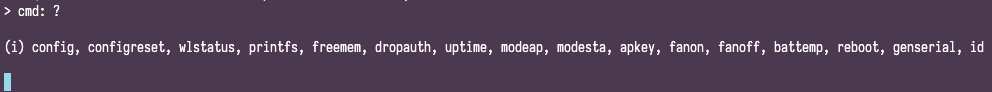
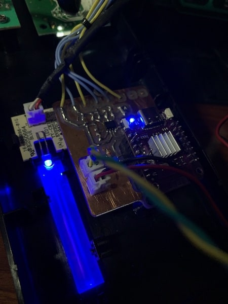

<pre align="center" background-color="transparent">

  |   _)              |  | _ \   __| 
   _|  |    \   |  |  |  | __/ \__ \ 
 \__| _| _| _| \_, | \__/ _|   ____/ 
               ___/                  
</pre>
<p style="text-align:center">

</p>

<br>

## **+ DESCRIPTION** 

**tinyUPS** is the way to extend functionality of an Uninterruptible Power Supply (UPS)/power inverters.
It provides onboard SNMP server, temperature control and a Control Panel (CP), just like on an enterprise systems. 
The project is now on beta test stage, however it shows very stable results during months 24/7. If you'll decide to modify your own UPS it's at your own risk.

<table cellpadding="0" cellspacing="0" width="100%">
<tr style="border-bottom: 1px solid;">
<td width="50px" style="text-align:center; padding-top:20px;">


</td>
<td>

The project requires an advanced skills in electronics. It's not a plug-n-play device. ;)

</td>
</tr>
<tr>
<td style="text-align:center; padding-top:20px;">


</td>
<td>

**Follow the standard precautions! Every UPS is a potentially dangerous device because it contains an electric parts under high voltage.**

</td>
</tr>
</table>


## **+ TOOLKIT**

- PlatformIO
- KiCAD

## **+ CONTROLLER**
**tinyUPS** is originally based on [WEMOS S2 mini](https://www.wemos.cc/en/latest/s2/s2_mini.html) board. However very likely it would work on another ESP32 boards with minor changes in firmware.
All the configuration you may need is in [platformio.ini](platformio.ini) and the UPS driver header file. If the communication interface of a particular UPS is not SPI, you need to create a new UPS driver and to change the PCB as well.

<table cellpadding="0" cellspacing="0" width="100%">
<tr>
<td width="50px" style="text-align:center; padding-top:20px;">


</td>
<td>

If you've created a new driver please share it by creating merge request or attaching it in discussions.

</td>
</tr>
</table>

## **+ PCB**
The [current PCB](schematics/CAM/tinyUPS.kicad_pcb) is designed for DIY via CAM method. If you want it printed profesionally, you may need to redesign the PCB.
Since the most of the UPS controllers have 5V data bus, we need a level shifter to be able to communicate with them and a small step-down PSU for ESP32. 

[Bill of materials](schematics/CAM/tinyUPS.csv). Instead of the BSS138 mosfets could be used any compatible type, ex.: IRLML2502.

If you'll be using S2 mini board you need to desolder built-in LDO IC (ME6211C33) since power will be supplied directly to 3.3V pin. It's possible to keep the LDO but you will not be able to use serial port for firmware upload and debugging. See [WEMOS S2 mini schematics](schematics/sch_s2_mini_v1.0.0.pdf).

The example driver is for a built in SPI LCD display, for a particular manufacturer and model. 
You'll probably have the very different device and may be even without any LCD display, so you'd need to figure out how to speak with the controller. This part is DIY. Feel free to call for help in Discussions.

## **+ Web UI**
**tinyUPS** has web UI based at [tailwindcss](https://tailwindcss.com/)/[flowbite](https://github.com/themesberg/flowbite) and [webpack](https://webpack.js.org/concepts/).

UI translations are available in [./web/lang](./web/lang) directory. You're able to add a new one or remove existing if you wish by editing the header of [common.js](web/src/common.js) script. Variable <code>i18nlang</code> contains the list of available locales to be built-in, where element 0 of the array is also a fallback (used by default) locale. Remove unnecessary locales from <code>i18nlang</code> to save space on file system partition.

The package manager is <code>yarn</code> so if you're not familiar with it continue with the folowing to build the UI:

```bash
cd ./web
yarn build:prod
```

that's all you need to prepare the FS to upload. Use "Upload Filesystem Image" command from PlatformIO project tasks or:

```bash
platformio run --target uploadfs --environment esp32s2_lolin
```

<br>

## **+ SETUP**
When you first run **tinyUPS** it boots up in AP mode. Look for `tinyUPS.01.XXXX` WiFi network. Default network password (config.apkey) could be changed in [helpers.h](src/helpers.h). Once connected the configuration is available on 192.168.4.1.


When setup is completed **tinyUPS** restarts, expecting an automatically assigned IP.

You are able to restart the device or reset configuration data to defaults using Control Panel -> Service Menu:


and then continue with confirmation:


<br>

## **+ CONTROL PANEL**

The UI is pretty simple and displays most of the real-time parameters. There are multiple self explanatory graphical representations for the collected data.


**tinyUPS** may be monitored remotely via JSON API, in practice it may be easily included in a local smart home network. To get access to API you need to add an API key (go to Configuration -> API):


Now you're able to send a post request using similar url format:

```
http://tinyUPS_ip_address/command?key=154aae95aa657fc37e0fa7e712dd7856
```

<br>

## **+ DRIVERS**
There are the following functions that must be implemented by every UPS driver: `upsDriverInit, upsDriverLoop, upsDriverDeinit`. 
You may also wish to look at the driver for thermistor (currently this is 1k M52A), it may need some changes. Depends on which thermistor you'll be using.

<br>

## **+ DEBUG**
Serial monitor is used to perform the most of the tasks and to solve issues. Once you've connected use <code>?</code> to request the commands list.



<br>

## **+ PHOTOS**

|  |  |  |  | 
|:---:|:---:|:---:|:---:|

<br>

## **+ CREDITS**

- Arduino [SNMP agent](https://github.com/0neblock/Arduino_SNMP) by #0neblock
- [ESPAsyncWebServer](https://github.com/me-no-dev/ESPAsyncWebServer)
- [Hash library](https://github.com/bbx10/Hash_tng)
- Icons by [Heroicons](https://heroicons.com/) & [Boxicons](https://boxicons.com/)

